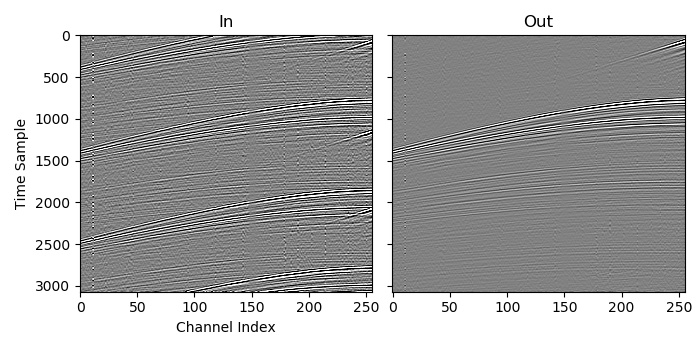

# AGDeblend

AGDeblend contains tools to deblend seismic data (separate overlapping shots) and synthetically blend or adjust pseudo-deblended data.

Its aim is to be suitable for both research benchmarking and production. It is thus quick and easy to setup for simple cases, but provides flexibility to handle real-life datasets.

## Features

- Written in C, with wrappers provided for Python, Julia, and Fortran
- Uses basis pursuit (L1 norm minimising inversion) in the Fourier domain
- Parallel processing using MPI (optional) and OpenMP (also optional)
- Works with any data arrangement and number of dimensions ((SourceX, SourceY), (SourceX, ChannelX, ChannelY), (CMP, Offset), etc.)
- Works with any library that implements the FFTW3 interface (such as FFTW3 and Intel MKL)
- Support for:
  - Bad and missing traces (and thus irregular data volume shapes)
  - Source wavelet convolution (useful for Vibroseis data)
  - Disjoint source volumes (sources operating in separate areas or interference from another survey)
  - Disjoint recordings (there may be gaps in the continuous records)

## Get started

The [documentation](https://ausargeo.pages.dev/agdeblend) contains instructions for installing and using AGDeblend, as well as a description of the included examples.
