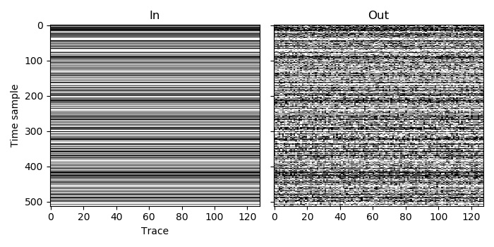

Example 1
=========

This is a simple example of blending. We start with an unblended (no blending noise) dataset, and then blend it to create a dataset with blending noise.

The prepared dataset contains 128 traces, each with 512 time samples. As we wish to simulate real blending, we use the :c:enumerator:`AGDBlendSum` blend mode, which will sum samples that overlap in the continuous record.

In the prepared dataset, all of the traces are recorded by the same channel, so the entry in the channel array is the same for each trace. In this case the channel label of 0 was used, but the result would be the same with any value, as long as it was the same one for all traces. If some of the traces were recorded by different channels, we would simply need to change the channel value for them, and would not need to make any other changes to the code.

All of the traces in the prepared dataset are also labelled as being live, so all have the value :c:enumerator:`AGDLive` (which happens to be 0). Again, changing the label of some to bad or missing would not require any other changes to the code.

As this is a straightforward use of the blending function, in each language we only need to load the input data, call the blending function, and save the output.

`C code <https://github.com/ar4/agdeblend/blob/main/examples/example_1.c>`_, `Python code <https://github.com/ar4/agdeblend/blob/main/examples/example_1.py>`_, `Julia code <https://github.com/ar4/agdeblend/blob/main/examples/example_1.jl>`_, `Fortran code <https://github.com/ar4/agdeblend/blob/main/examples/example_1.f90>`_, `C++ code <https://github.com/ar4/agdeblend/blob/main/examples/example_1.cpp>`_

