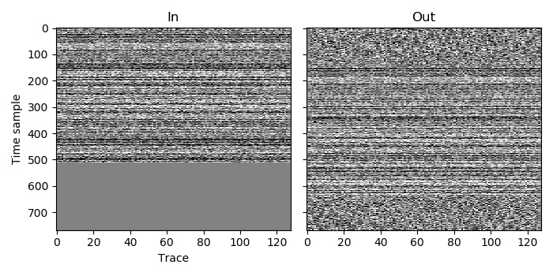

Example 2
=========

A dataset may have been acquired using blended acquisition, and so contain blending noise, but you may wish to adjust it from the pseudo-deblended form in which you currently have it. A variety of such adjustments can be made with AGDeblend. One possible type of adjustment is to increase the length of the traces. This can be done by recreating the continuous record and then extracting the desired pseudo-deblended traces (by copying more samples from the continuous record for each of them, if you want longer traces). That is the task demonstrated by this example.

As in :doc:`example_1`, we have 128 traces, each with 512 time samples. This time, however, we start with traces that have already been blended and so have blending noise. We wish to extend the traces to 768 time samples, and we also wish to start the extraction from the continuous record slightly earlier for each trace.

This time, we do not want to use :c:enumerator:`AGDBlendSum` as the recordings already contain blending noise. If we used that, then we would be adding samples with blending noise to themselves. We should instead use either :c:enumerator:`AGDBlendMean` or :c:enumerator:`AGDBlendOverwrite`. If we are certain that overlapping samples have the same value, then the latter is more efficient, but they should both produce the same output in that case. In this example :c:enumerator:`AGDBlendMean` is used with a taper length of 16. This means that a cosine taper of length 16 will be applied to the ends of each trace's weight when calculating the weighted mean across all overlapping samples (so if a sample from the beginning of one trace overlaps in the continuous record with a sample from the middle of another trace, then the latter will have a greater effect on the computed value for that sample in the continuous record).

`C code <https://github/com/ar4/agdeblend/blob/master/examples/example_2.c>`_, `Python code <https://github/com/ar4/agdeblend/blob/master/examples/example_2.py>`_, `Julia code <https://github/com/ar4/agdeblend/blob/master/examples/example_2.jl>`_, `Fortran code <https://github/com/ar4/agdeblend/blob/master/examples/example_2.f90>`_

