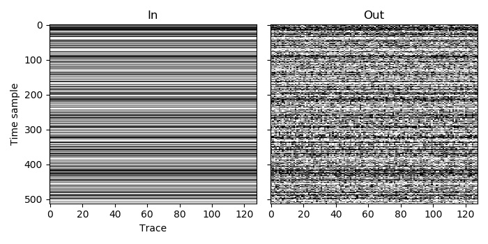

Example 3
=========

It may not be possible to fit large datasets into the memory of a single processor, so AGDeblend makes it possible to split the dataset over multiple by using MPI. This example repeats the task performed in :doc:`example_1` of synthetically blending an unblended dataset, and produces identical results, but splits the dataset among two processors. As MPI can also be run on multiple cores of a single processor, this example can be tested without access to a cluster. 

Each process only has one patch in this example, so, although in total we use two patches (one on each process), we only define inputs for one patch on each process. In this example we therefore specify that the input consists of one patch of 64 traces. The first 64 traces of the input dataset will be assigned to the first process, and the remaining 64 traces will be assigned to the second (giving a total of 128 traces, as in :doc:`example_1`).

The code for this example is more complicated than :doc:`example_1` because of the necessity to load the correct portion of the input files on each process, and to save the outputs to the correct place in the output file. MPI I/O could be used for these file operations, but for simplicity is not.

As we are using MPI in this example, we need to pass the MPI Communicator to the blending function.

`C code <https://github.com/ar4/agdeblend/blob/main/examples/example_3.c>`_, `Python code <https://github.com/ar4/agdeblend/blob/main/examples/example_3.py>`_, `Julia code <https://github.com/ar4/agdeblend/blob/main/examples/example_3.jl>`_, `Fortran code <https://github.com/ar4/agdeblend/blob/main/examples/example_3.F90>`_

