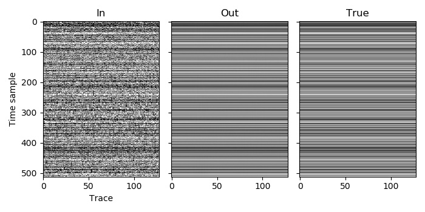

Example 4
=========

In this example we move onto performing deblending. It is a simple case with one patch.

There is only one volume, so the volume index of the patch is 0. We only use one spatial dimension, so the dimension of this volume is 2 (one space dimension and the time dimension). We then need to choose the window length in these two dimensions for the volume. The recordings have been high-pass filtered to not have any wavelengths larger than 128 time samples, so we use a time window of 256 time samples (twice the maximum wavelength). In this case the signal is still well approximated as being planar over all 128 traces, so we should use that as our spatial window length (as more traces will produce better results), but just to demonstrate the case when we have multiple windows in the spatial dimension, we will instead use 32.

We only have one patch in this example, so we can use any value for its coordinates (the coordinates are used specify the relative placement of multiple patches within a volume). As we have one spatial dimension, the coordinate array for the patch should contain one element.

As the signal is perfectly planar in this example and so can be efficiently represented in the Fourier domain, it is likely that an initial threshold factor lower than one could be used to reduce the number of iterations required to get a good result, but for simplicity we leave it at one. We also choose to not print the norm of the residual by setting the printing frequency to be zero or less (-1 in this case).

`C code <https://github/com/ar4/agdeblend/blob/master/examples/example_4.c>`_, `Python code <https://github/com/ar4/agdeblend/blob/master/examples/example_4.py>`_, `Julia code <https://github/com/ar4/agdeblend/blob/master/examples/example_4.jl>`_, `Fortran code <https://github/com/ar4/agdeblend/blob/master/examples/example_4.f90>`_

