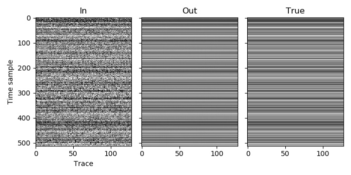

Example 5
=========

In this example we progress to deblending two patches. We don't use MPI, so there is only one process and both patches are assigned to it. A later example will be more complicated, but in this one we keep things (relatively) simple by only having one spatial dimension.

We still only have one volume, so it will have index 0 and we will specify this as the volume index of both patches. The number of dimensions and the window shapes are per volume, not per patch, and so we still only have one of both. We are going to place the second patch next to the first, so on our grid of patches they are adjacent to each other and so we set their coordinates as 0 and 1, but we could have used any two adjacent numbers.

Although we are once again working on the same dataset with 128 traces, this time we assign 80 traces to the first patch, and 64 traces to the second patch. Why is that, since when we split the dataset into two patches in the earlier :doc:`blending example <example_3>` we only had 64 traces in each patch? The reason is that we need to overlap neighbouring patches when deblending. When we only used one patch in :doc:`the previous example <example_4>`, AGDeblend divided the patch into overlapping windows (with half a window length of overlap). The windows still need to overlap when using more than one patch, so we need to overlap the patches for this to be possible.

There are many options for how we divide the dataset, with overlapping, between the two patches. Since we use a window length of 32 in the space dimension, we need an overlap of 16 traces between the two patches. One option would be to assign the first 72 traces (64 plus 8) to the first patch, and the last 72 traces to the second patch. As we have 128 traces, that will cause the desired overlap of 16 traces. This would work, but would not give us an identical result to the single patch case as how the traces are assigned to windows would be different. Even though we are now using two patches, we still want to get an output that is identical to the one we got with one patch (not essential in practice, but good for understanding). With a single patch, the windows would cover traces :math:`[0:32), [16:48), \ldots, [96:128)`. 16 does not divide evenly into 72, however, and so AGDeblend would need to make some of the windows larger in order to cover the patches.

By opting instead to have the first 80 traces in the first patch and the last 64 traces in the last patch, we still have an overlap of 16 traces, but now, since 16 divides evenly into both of these numbers, we will have the same assignment of traces to windows, and so should get exactly the same result as in the single patch case.

The overlap of the patches is again relevant at the end of the example when we are ready to write the output to a file. In the overlap region between the two patches, the amplitude of the estimated signal will be shared between both patches. We therefore need to sum the corresponding overlapping traces from the two patches to obtain the output for those traces. In this example we do that by adding the first 16 traces of the second patch to the last 16 traces of the first patch. When we write the traces to the output file, we then write all of the traces from the first patch, but we skip the first 16 traces of the second patch as they have already been taken care of by the first patch, so the output file will end-up with the desired 128 traces.

`C code <https://github.com/ar4/agdeblend/blob/main/examples/example_5.c>`_, `Python code <https://github.com/ar4/agdeblend/blob/main/examples/example_5.py>`_, `Julia code <https://github.com/ar4/agdeblend/blob/main/examples/example_5.jl>`_, `Fortran code <https://github.com/ar4/agdeblend/blob/main/examples/example_5.f90>`_

