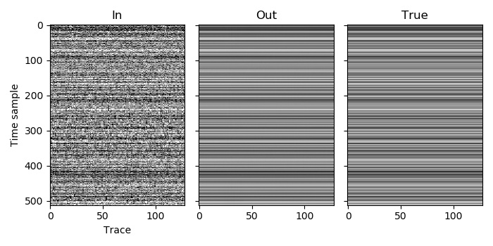

Example 6
=========

The :doc:`previous example <example_5>` was probably a bit more complicated than you were expecting for a simple deblending of two patches, but it has set us up to now perform the deblending using MPI. In fact, nothing substantial needs to change, but with this we are able to split our dataset among processors and run deblending in parallel, while still getting exactly the same answer as if we had run it all on one processor with a single patch.

As we saw in the :doc:`previous MPI example <example_3>`, each process will only load the patches that are assigned to it, so even though there are two patches in total, each process in this example will only load one patch.

The one slight complication is summing the overlapping traces before we write the output to disk. We again choose to do this by adding the first 16 traces from the second patch to the last 16 traces of the first patch. Previously they were both on the same process and so this was easy. They are now on different processes, so we use MPI to transfer the traces from process 1 into a buffer on process 0, and then on process 0 add the buffer to the last 16 traces.

`C code <https://github/com/ar4/agdeblend/blob/master/examples/example_6.c>`_, `Python code <https://github/com/ar4/agdeblend/blob/master/examples/example_6.py>`_, `Julia code <https://github/com/ar4/agdeblend/blob/master/examples/example_6.jl>`_, `Fortran code <https://github/com/ar4/agdeblend/blob/master/examples/example_6.F90>`_

