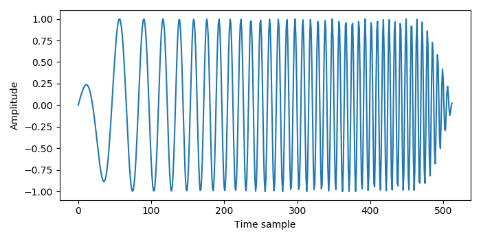
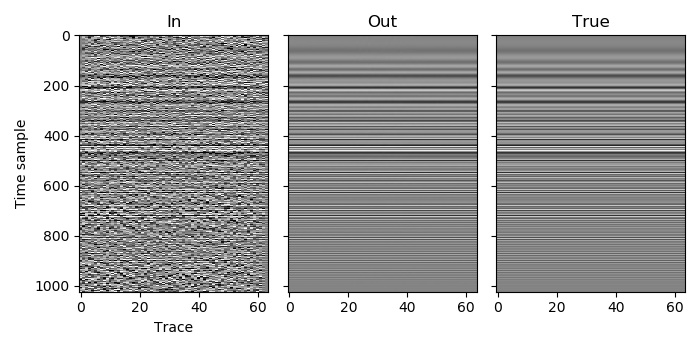

Example 7
=========

This example is a simple deblending of one patch, with the only difference from :doc:`example_4` being that a chirp source wavelet is used. Although this dataset could be deblended as normal without providing the source wavelet, it is advantageous to provide it when it is long. In this example there is a single source wavelet that is used for all traces, and it has 513 time samples. The model for each window, after the inverse Fourier transform, will thus produce traces with 512 time samples (:math:`1024 - 513 + 1`), and these will be convolved with the source wavelet to produce traces with the same length as the input (1024), which will then be blended to compare with the continuous record of the input data.

Other than providing the wavelets and specifying which index in this list of wavelets to use for each trace (all zeros in this case, since we use the same wavelet for every trace), we don't have to do anything different for this example.

`C code <https://github/com/ar4/agdeblend/blob/master/examples/example_7.c>`_, `Python code <https://github/com/ar4/agdeblend/blob/master/examples/example_7.py>`_, `Julia code <https://github/com/ar4/agdeblend/blob/master/examples/example_7.jl>`_, `Fortran code <https://github/com/ar4/agdeblend/blob/master/examples/example_7.f90>`_

