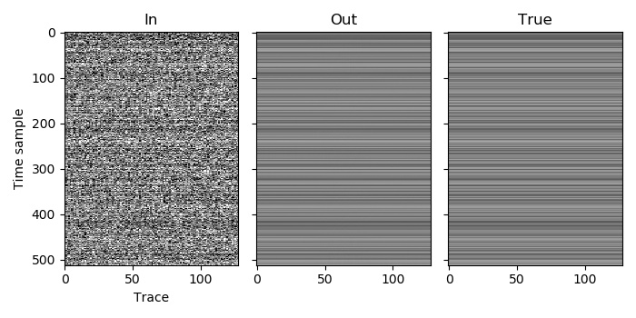
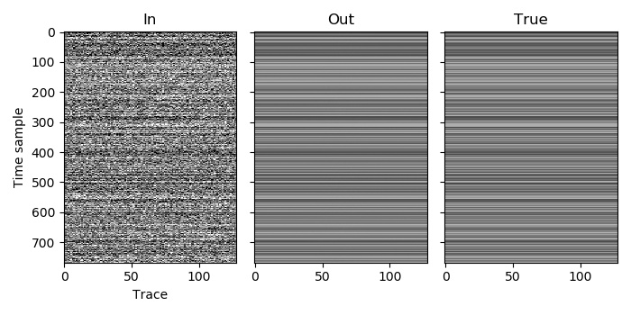

Example 8
=========

This example demonstrates a situation similar to signal interference from another nearby survey (that we have shot times for), or blending with another source that is operating in a separate area of the survey. Since the sources are operating in different places and never cover adjacent or overlapping areas, we do not wish for traces from the two sources to be included in the same Fourier transform windows as they are unlikely to contain coherent arrivals. We could achieve this in general by providing their traces as two patches within the same volume but with coordinates that are not adjacent (0 and 2, for example). A cleaner option, and the one we use here, is to put them in two different volumes. In this example the latter is not only cleaner, but also required as we use longer traces for one of the sources, but traces within the same volume all must have the same length.

Both of the volumes contain 128 traces. Those in the first volume have 512 time samples, while those in the second volume have 768 time samples. Since we must use zero-indexed values to label the volume that each patch belongs to, we specify that the first patch has volume index 0 and the second patch has volume index 1. Both volumes have only one space dimension and one time dimension, so the `n_dims` value for both volumes is 2. We must also specify a window shape for both volumes, which we set to be 64 traces and 256 time samples for both. As there is only one patch in each volume, the coordinates are not important and we can set them to any value (0 for both, for simplicity).

Both sources in the input shoot on a similar schedule, so there is substantial blending in this example. Each source blends with itself, as it fires another shot while arrivals from the previous one are still being recorded, but also overlaps with the other source, and with the other source overlapping with itself. That makes this problem more difficult, which is why the number of iterations is increased to 2500.

`C code <https://github/com/ar4/agdeblend/blob/master/examples/example_8.c>`_, `Python code <https://github/com/ar4/agdeblend/blob/master/examples/example_8.py>`_, `Julia code <https://github/com/ar4/agdeblend/blob/master/examples/example_8.jl>`_, `Fortran code <https://github/com/ar4/agdeblend/blob/master/examples/example_8.f90>`_

