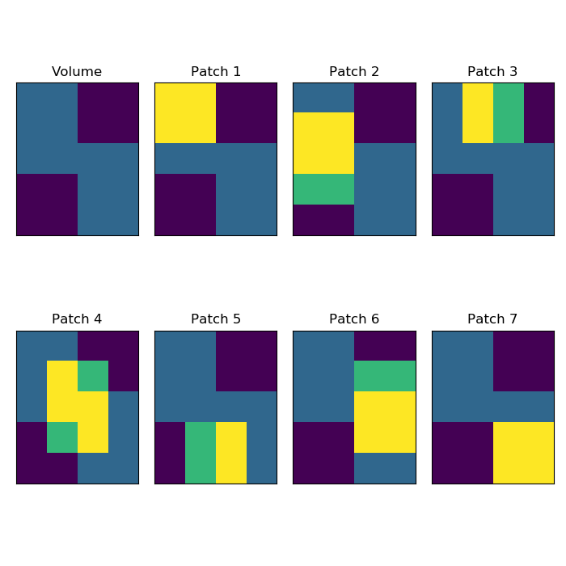
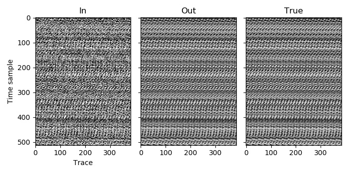
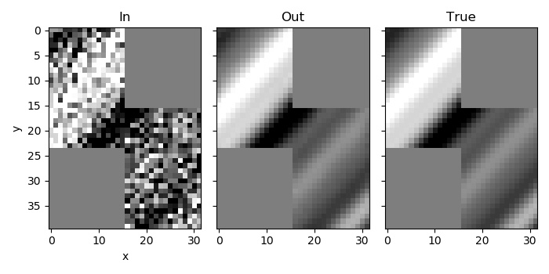

Example 9
=========

This is quite a complicated example, so prepare yourself!

In this case the traces are arranged in an irregular shape. It could be that we are using SourceX and SourceY as the data dimensions, and the survey does not cover a rectangle, for example. We are thus going to need to assign traces to patches carefully, and specify the coordinates of the patches within the volume.

The live traces cover two adjacent rectangles: :math:`([0:16), [0:24))`, and :math:`([16:32), [16:40))`. (For column-major languages the dimensions would be swapped.) In the input, these two blocks are stored in two different files (with the extensions `_0` and `_1`).

We could still deblend this with one patch, and just label the traces in the top right and bottom left, which are not covered by the two blocks, as missing. That should work reasonably well (although it does not give much control over window placement, which we shall see is important), but it will be more instructive to instead divide the regions that contain live traces into patches, and to not have any patches in the top right and bottom left.

The grid on which patches are arranged to cover a volume includes an overlap of half a window length between patches in each space dimension. When choosing how to divide the trace among patches, we need to consider this. Another important consideration is that we should try to ensure that each window will contain enough live traces for minimisation of the L1 norm to constrain the solution to be similar to planar seismic arrivals. If a window contains very few live traces, then this is unlikely to be the case. As we have large regions of missing traces, we need to be careful where the window boundaries will be so that we don't end-up with windows that mostly contain missing traces.

A plausible arrangement of patches is thus to have a :math:`16 \times 16` patch in the top left and bottom right, which will contain only live traces, and five patches covering the interior edges of these. The latter five patches will each have the necessary 8 trace overlap with their neighbours, and also at least half of the traces that they contain will be live. Some of the patches are the same size as the windows and so will only contain one window.

  The areas of the volume that contain live traces are visible in the Volume subplot (the lighter areas), while the remaining subplots show the traces covered by the seven patches (yellow denotes overlap with the live traces, while green corresponds to traces included in the patch that are not live).

Whether the edge of a patch is tapered or not depends on if it has an adjacent neighbour. Adjacent in this case also includes diagonal neighbours, so Patch 3 will be tapered on all sides except the top. There is no patch directly to its right, but there is a diagonal neighbour to its lower right, which will trigger tapering of the right side. For a similar reason, Patch 1 would be tapered on the right even if Patch 3 were not there, and that is why we need Patch 3 - to compensate for the taper (the taper on the right of Patch 1 and on the left of Patch 3 will sum to one).

For simplicity, we allocate a memory to store the input data as if we had a full rectangle of traces of shape :math:`(32, 40)`, and then copy the inputs into the appropriate places. We can then extract the portions for each patch.

Similarly, we allocate the same full rectangle to copy the output patches into and then extract from this the ranges for the two output files (which cover the same regions as the two input files).

`C code <https://github/com/ar4/agdeblend/blob/master/examples/example_9.c>`_, `Python code <https://github/com/ar4/agdeblend/blob/master/examples/example_9.py>`_, `Julia code <https://github/com/ar4/agdeblend/blob/master/examples/example_9.jl>`_, `Fortran code <https://github/com/ar4/agdeblend/blob/master/examples/example_9.f90>`_

  The traces from the first file

  The traces from the second file
  

  A time slice through the volume
