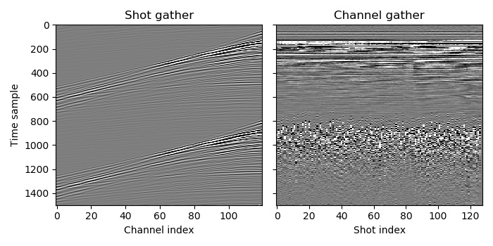
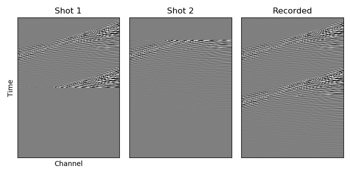
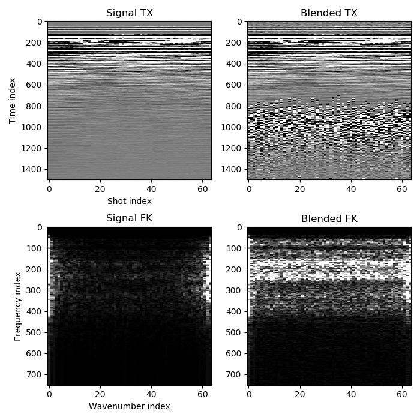

Introduction
============

For those who are new to deblending, we begin with an explanation of what it is and a general description of how it works. This is then followed by a discussion of AGDeblend in particular, covering the concepts that you should understand to use it.

Blending and Deblending
-----------------------

Seismic shot records should ideally only contain recordings of waves produced by that shot's source, as this is typically an assumption of methods used for processing the data. In reality they also contain various types of noise that we must attempt to attenuate. One type of noise is interference from other sources. These may be sources from another nearby survey (known as signal interference or SI), or they may be sources from the same survey that were intentionally triggered while another shot was still being recorded (a technique to perform the survey more quickly known as blended acquisition, causing blending noise). Deblending attempts to separate these overlapping arrivals from different sources. It is most commonly used with blended acquisition, but can also be applied to signal interference (sometimes requiring knowledge of the shot times of the interfering sources, depending on the deblending method). As there will often be orders of magnitude of difference between the amplitudes of overlapping arrivals from different shots (with the direct arrival of one shot overlapping arrivals from several seconds after the previous shot was fired), deblending is a very difficult task and perfect separation is usually not possible.

Surveys with blended acquisition typically use continuous recording. The receivers record continuously, and then the record for each shot with unattenuated blending noise (also known as the "pseudo-deblended" or sometimes "combed" record) is extracted from this by copying a specified number of samples after the shot firing time from the continuous record. Deblending attempts to remove the blending noise from these records so that they look like blended acquisition was not used.

  Pseudo-deblended data. In the shot gather, arrivals from the previous and next shot are visible but difficult to distinguish from the current shot's arrivals, while in the channel gather the blending noise is clearly less coherent across traces than the signal, due to randomness in shot firing times.

Many methods have been proposed to perform deblending. These usually either use traditional denoising techniques to attenuate the blending noise, or try to separate the shots using an inversion approach. The latter, which is generally more successful, is used by AGDeblend and so will be our focus.

The inversion approach uses the fact that if we had the true recordings (no blending noise) and we blended them (shifted them in time to the time that the shot was fired and summed across shots), the result should match the recorded data. This can be expressed mathematically as:

.. math:: d_o = \Gamma d_t,

where :math:`d_o` is the observed continuous recording (with overlapping), :math:`\Gamma` is the blending operator (shifting in time and summing), and :math:`d_t` is the true recording of each shot (no blending noise).

Since we know :math:`d_o` and :math:`\Gamma` (and it is linear), and we want to obtain :math:`d_t`, this is a linear inverse problem. We might thus think that we could simply apply an inverse problem solver. Unfortunately, that will not work well as this is an underdetermined problem (if you express :math:`\Gamma` as a matrix, it has fewer rows than columns), which means that there are an infinite number of solutions that will satisfy this. Here is one example:

  Deblending is underdetermined, with an infinite number of possible solutions. If we blended the true recordings the result would match the recorded data, but if we blend these obviously incorrect recordings then we will also obtain the same recorded data.

To resolve this, we must add an additional constraint. One that is popular in deblending methods is to minimize the norm in Fourier transformed windows of the estimated true data. This approach relies on the hope that the true recordings can be represented more efficiently in the Fourier domain than the other possible solutions can, so minimising the norm should select the true solution from the infinite number of possible solutions. There are two requirements for this to be reasonable. One is that the true arrivals are approximately locally planar across shots (and so can be compactly represented in the windowed Fourier transform domain). The second is that the timing of the shots have an element of randomness, so that the blending noise is incoherent across shots (and so is transformed into random noise in the Fourier domain). Here is a typical example:

  The true signal is compact in the Fourier domain while the blending noise becomes random noise.

These requirements are often fairly well met by typical seismic surveys, especially deep marine tower streamer datasets with good source sampling, but can be problematic when there are variations near the sources or receivers that cause substantial changes in the recorded arrivals between shots (such as in shallow water or land surveys with a variable near surface).

Data samples provided for inversion-based deblending should be as close to raw data as possible because the inversion process will try to find a solution that matches the recorded data when blended, but any processing performed before deblending may interfere with this. Denoising methods that act across shots are particularly damaging as they will likely severely affect the blending noise that is needed for inversion. Noise that is not caused by blending can also reduce the ability to deblend successfully, however. Such noise may transform into random noise across all wavenumbers in the Fourier domain, potentially making a solution that includes blending noise have a lower L1 norm than the true signal, due to the triangle inequality (the components of the two types of noise may have opposite sign and so lead to cancellation). In such cases, careful processing to attenuate such noise without substantially affecting the signal or blending noise might be beneficial before deblending. Frequency filters and common shot gather denoising are generally the safest options.

Deblending will usually reduce the blending noise, but it is a difficult task and so even in ideal cases there will often still be a visible residual and some signal loss. The likelihood of success is mostly determined by how large the regions of traces are over which arrivals are approximately planar, the blending factor (the number of shots that arrivals are simultaneously being recorded from, also known as the blending fold), and by the level of non-blending noise in the data.

AGDeblend Concepts
------------------

Although AGDeblend aims to be easy to use, there are some concepts that are important to understand before using it.

AGDeblend consists of a blend function and a deblend function. The concepts needed for the blend function are a subset of those needed for deblending.

Basis Pursuit in the Fourier Domain
^^^^^^^^^^^^^^^^^^^^^^^^^^^^^^^^^^^

Deblending is often implemented by minimising the norm in a transformed domain in which seismic arrivals are expected to be efficiently represented. AGDeblend uses the multidimensional Fourier transform and minimises the L1 norm (also known as basis pursuit). It is possible that better results might be obtainable with other transforms and norms, but this combination was chosen as the best match for AGDeblend's goals. The Fourier transform is efficient and implementations are widely available. The L1 norm is convex (unlike some other possible options, such as the L0 norm), resulting in reliable solver methods such as ISTA.

Windows of data (discussed below) are Fourier transformed in all dimensions. The most important consideration when choosing the setup for deblending is how to cause the maximum separation in the Fourier domain between the signal and the blending noise, which usually means what will cause the signal to be represented as compactly as possible (since the blending noise across shots will transform into uniform random noise).

To enhance the ability to compactly represent the signal, windows are zero-padded in each dimension (with one quarter of the length of that dimension, by default) before being transformed. Hann window tapers are also used in every dimension.

Despite these efforts, it is still likely that the solution with the minimum L1 norm will not be exactly the true solution. Variations from shot to shot may not be more coherent (especially at high frequencies) than blending noise, and so assigning these amplitudes to the correct shot will not necessarily reduce the L1 norm. These variations are thus likely to instead be shared between overlapping shots, resulting in signal loss and an equal amount of residual blending noise.

AGDeblend uses the ISTA (iterative shrinkage and thresholding algorithm) method with a decaying threshold to perform basis pursuit. At each iteration this soft thresholds the components in the Fourier domain, decreasing their amplitude so that any below the current threshold are zeroed. This will initially result in all but the highest amplitude components in the Fourier domain being zeroed. These high amplitude components are likely to correspond to the most coherent strong arrivals in the data. These components will then be used to predict and remove blending noise in overlapping shots, so that in the next iteration the amplitude of components in the Fourier domain corresponding to blending noise should decrease, allowing the ISTA threshold to decrease without including them. In this way the threshold can be decayed to zero over the iterations of the deblending method, gradually predicting and removing more of the blending noise. Ideally, the threshold should decay slowly enough so that no blending noise ever passes it. Increasing the number of iterations (and thus decreasing the rate at which the threshold decays) should therefore improve the result. If the strongest components of the blending noise in the Fourier domain are substantially weaker than the strongest signal components, setting the initial threshold factor to a value lower than one can reduce the number of iterations required to obtain a good result. The initial threshold will be multiplied by this factor, and so start at a smaller value rather than decaying from the maximum amplitude in the Fourier domain.

Volumes, Patches, and Windows
^^^^^^^^^^^^^^^^^^^^^^^^^^^^^

AGDeblend uses three levels of division of the data when deblending. The largest are volumes, which are divided into patches, which are in turn divided into windows. The user provides the data already divided into volumes and patches, but only has to specify the shape of windows that the patches should be divided into.

Volumes correspond to blocks of data that are separate in space. In many cases, only one volume will be used, but the ability to use multiple volumes is useful for situations such as when there is interference from a nearby survey. We wish to include this other survey in our deblending (so that it can be separated from our survey's data), but we do not expect that arrivals in that survey's traces will be coherent with those in our survey, and so do not want them to be Fourier transformed together. Arranging them in different volumes achieves this. Different volumes may have different dimensions, such as (CMP, Offset) for one (a volume from a 2D survey) and (ShotX, ShotY, ChannelX, ChannelY) for another (a nearby 3D survey causing interference). Although there is freedom to choose the most appropriate dimensions for your survey, incorporating as many source dimensions as possible is usually helpful as that tends to be where the difference between the signal and blending noise is most obvious. It is not possible to distinguish signal and blending noise using channel dimensions alone, so at least one source-related dimension should be used, but channel dimensions can also be helpful as the blending noise may have a different dip compared to the signal, improving separability. Adding extra dimensions substantially increases the memory and computational cost, however, so they should be chosen carefully. The only constraint on dimensions is that the time dimension must always be included in every volume and must be the "fast" dimension (contiguous in memory).

In simple cases you might also only use one patch. There are two main reasons for using multiple patches: to split the survey into blocks that can be handled by different MPI processes, and for irregular survey layouts. MPI is the recommended method of achieving parallel processing with AGDeblend, and is the only way of splitting the dataset across multiple nodes on a distributed memory system. Each MPI process must be assigned different patches, with a typical approach being to have one patch for each process. Neighbouring patches should overlap with each other by half a window length, which is one of the more complicated parts of using AGDeblend. See Examples :doc:`5 <example_5>` and :doc:`6 <example_6>` for simple demonstrations. Patches need to be hyperrectangles. The patches are on a grid, with a location specified by their coordinates, but not all cells of the grid need to have a patch assigned to them, allowing you to create irregularly shaped volumes. There is an example of this in :doc:`example_9`.

If we label the coordinates of a patch that covers the range :math:`([0:16), [0:32))` of a volume with two spatial dimensions as :math:`(0, 0)`, and if the window shape in this volume is :math:`(16, 16)`, then the coordinates :math:`(1, 1)` would refer to a patch that starts at the point :math:`(8, 24)` (as this is :math:`(16, 32)` minus half a window length of overlap in each dimension). If every patch in the volume has shape :math:`16 \times 32`, then the patch with coordinates :math:`(2, 1)` would cover the range :math:`([16:32), [24:56))`. Patches do not need to all be the same shape, however, but those with the same coordinate in a particular dimension do need to have the same length in that dimension. If a patch with coordinate 1 in the first dimension has length 24 in the first dimension, then all other patches with coordinate 1 in the first dimension also need to have length 24 in that dimension. It is up to the user to ensure that patches have the correct shapes and are overlapped correctly. AGDeblend does not check this.

Seismic arrivals are often well approximated by planes over a small number of neighbouring traces. The purpose of windows is to further decompose patches into overlapping windows that contain a small enough number of traces for this to be true. Each window is separately transformed into the Fourier domain, so the window shape should be chosen to be the largest number of traces in each dimension over which the arrivals look approximately planar. The recordings are also divided into windows in time. The recommended window length in the time dimension is twice the maximum wavelength (in units of time samples). Each volume may have a different window shape, but it is advisable to have approximately the same number of samples in every window. The window shapes do not need to evenly divide into the patch shape as some will be automatically made larger to cover the patch if necessary.

Window lengths must be even unless the window covers the whole patch in that dimension and the patch has no neighbours on either side in that dimension. A common example where an odd window length is used is in multi-source marine surveys, where a source vessel may have an odd number of sources, such as three. You may choose to use the gun index as one of your dimensions, so that dimension will be of length three and you can thus use a window length of three in that dimension.

Disjoint Continuous Recording
^^^^^^^^^^^^^^^^^^^^^^^^^^^^^

In a typical blended survey, the receivers record continuously, so that the number of samples in the survey is the number of channels times the duration of the survey in time samples (before pseudo-deblending, which can make the number of samples substantially larger due to duplication). Blending and deblending both use the blending operator, which shifts traces in time and sums them to form a continuous record.

Sometimes, however, the continuous record is not actually fully continuous. Acquisition might stop during the night, for example, so there is a separate continuous record for each day with a gap of several hours between them. Blending occurs within each of these records, but not between them. It may still be advantageous to deblend multiple separate continuous records simultaneously, however, as they may be contiguous in space (a source line might be acquired next to another source line that was acquired the day before) and so help to identify signal and noise in each other.

AGDeblend supports such disjoint continuous records. Memory is only allocated to store the time samples for which there are recordings, so gaps, even of weeks, will not use additional memory. Each recording channel is treated separately, so the gaps may occur at different times for different channels.

Channels
^^^^^^^^

AGDeblend needs to know which channel each trace is from so that when the recordings are blended they can be added to the correct channel's continuous record. This information is supplied as an array, with one entry for each trace, through the input arguments. This provides flexibility in the arrangement of the provided data. It is possible, for example, for the input to all come from a single channel, in which case the channel array argument would be filled with the same number. Other possibilities include providing the input arranged with shot and channel dimensions, and CMP dimensions. The same channel can occur in different patches and volumes, and even on different nodes when using MPI, with AGDeblend arranging that the samples will still be added to the correct place in the continuous records.

Trace Types
^^^^^^^^^^^

In real surveys shots misfire and so we do not expect the arrivals in their record to be coherent with neighbouring shots. Similarly, there are bad receivers that only record noise, or bursts of noise in particular traces. Survey recordings can also often not be arranged in perfect hyperrectangles. The sources and receivers in 3D surveys are frequently not located on a rectangular grid, but there are instead groups of lines that are longer than others, or large holes around obstacles. Even when the recordings form a hyperrectangle when arranged with shot, channel, and time dimensions, you may wish to arrange them with CMP and offset dimensions when performing deblending, in which case the CMPs at the edges will probably have fewer offset traces than CMPs in the middle, causing it to no longer be a hyperrectangle. The approach used by AGDeblend for all of these situations is for the user to specify a trace type for each trace. The options are live, bad, and missing.

Only the sample values from live traces are used. The difference between bad and missing traces is small. Missing traces are ignored completely when blending (in both the blending and deblending functions). The shot time and channel specified for them is thus not used. The samples covered by a bad trace in the continuous record are, however, muted. Samples from live traces that overlap with the bad traces will thus also be muted. This is to avoid corrupting the live traces with bad values. As a result, the shot time and channel must be specified for bad traces.

One common situation where missing traces are useful is in multi-source marine surveys. A source vessel may tow several airgun sources that are fired in round-robin order. With these, it can be beneficial to use the gun index as one of the dimensions of the data, as this usually helps the arrivals to be more planar within windows. If there are three airguns, labelled 1, 2, and 3, from one side to the other, the first to be fired may not be 1. In that case we will not be able to form a hyperrectangle with planar arrivals (as such a hyperrectangle would require an entry for the missing shot). We can resolve this by creating traces in the place of the missing initial (and potentially final) shots and labelling them as missing.

The output of deblending will replace bad and missing traces with values predicted by the model. These may be useful, especially for bad or missing traces surrounded by live traces, but the deblending implementation and the L1 norm minimisation that it relies on, are not designed for interpolation and so it will probably be possible to get more accurate estimates of these missing trace values by using a dedicated interpolation method.

Wavelets
^^^^^^^^

For sources that have a long source wavelet, such as Vibroseis sources, it can be advantageous to convolve with the source wavelet prior to applying the blending operator when performing deblending. It can improve the deblending results, and it also reduces the memory requirement, if the same wavelet is shared by multiple traces, as the length of the stored model in the time domain will be :math:`nt_o - nt_w + 1`, where :math:`nt_o` is the recorded trace length and :math:`nt_w` is the length of the source wavelet.

You can provide as many source wavelets as you like, and, with the `wavelet_idxs` parameter, specify which of the wavelets to use for each trace. All of the traces within a volume must have wavelets of the same length, but different volumes may use wavelets of different lengths.

In AGDeblend only the phase information of the source wavelets is used.
